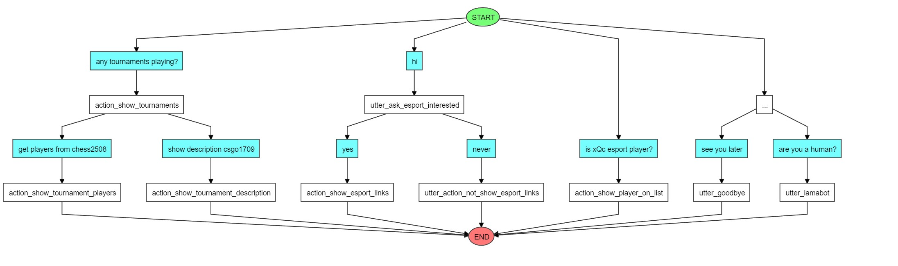

## Rasa based chatbot integrated with discord.

### Setup done from:
- https://www.geeksforgeeks.org/chatbots-using-python-and-rasa/
- https://realpython.com/how-to-make-a-discord-bot-python/


### Json data
list of tournaments which contain info, players and date
links data contain esport links that bot sends

### How to use
* Create conda env
```shell
    conda create -n rasa
    conda activate rasa
    pip install -r requirements.txt
```

* Create .env file with following contents

```
DISCORD_TOKEN=<your_bot_token>
DISCORD_GUILD=<your_guild_name, like RasaBasedChatbotGKProject>
```

#### Local setup

* Open terminal and type ```rasa run actions``` to run custom actions server.
* Open another and type ```rasa run``` to open main server
* Open another and type ```python server.py``` to start discord bot server

### Actions to take

1. Greeting. Users says hello and bot asks if user likes esport. If user says yes then the bot returns some esport links that may be interesting.
2. Showing active tournaments.
3. Showing players from tournament
4. Showing tournament description.
5. Asking if x is esport player. Bot calls wikipedia and scrapes list of esport players.

### Visualised graph

